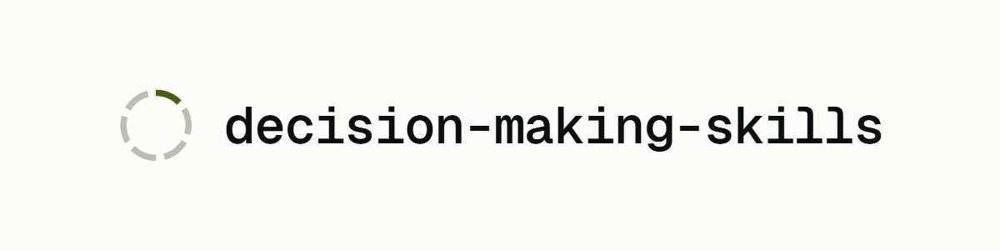

<div align="center">

<picture class="gh-only">
  <source media="(prefers-color-scheme: dark)" srcset="site/public/lockup-dark.png">
  
</picture>

[](https://github.com/AngelCampa1/decision-making-skills/actions/workflows/check.yml)
[](LICENSE)
[](pyproject.toml)
[](docs/STATUS.md)
[](SCORECARD.md)

</div>

Agent skills for making better decisions under uncertainty, plus an evaluation
harness that measures whether they actually work.

The mark is one row of a forest plot: a line of no effect, an interval, a point
estimate. The interval crosses zero, which is this repository's position stated
in the notation it argues in. It is *we have not shown this works*, not *this
does not work*, and [`SCORECARD.md`](SCORECARD.md) exists to keep those apart.

> Status: pre-alpha. No skill in this repository has been validated yet. The
> harness is being built first, deliberately. Until a skill carries a verdict
> in [`SCORECARD.md`](SCORECARD.md), treat it as an untested hypothesis.
>
> [`docs/STATUS.md`](docs/STATUS.md) is the ledger: every run on record, what
> it showed, which measurements turned out to be broken, and which tracks are
> still untouched.

## How this is measured

Most skill libraries ship on the author's word that the thing helps. This one is
built the other way round: the harness came first, and the claim is still
`UNTESTED`.

What that costs, in practice, is a set of mechanisms that make it hard to
overclaim by accident. The answer key is relabelled blind by three independent
model instances that never see the maintainer's label, against a kill threshold
fixed before the run. Every prediction since the convention was adopted is committed
to `notebook/` before its run, and `de check` refuses a published run whose
prediction cannot be shown by git ancestry to predate its data. Two runs predate
the rule and are baselined by name in
[`results/provenance-baseline.txt`](results/provenance-baseline.txt), a list
that may only shrink. The key carries a version stamped into every
record, and comparing arms across a version boundary is refused in code. That rule
exists because one correct label move raised recall on every arm on disk
without a single call being re-made. Primary metrics are deterministic; a judge never produces one.

None of that is a claim that the skills work. It is the reason this repository
can say they have not been shown to.

[`docs/METHODS.md`](docs/METHODS.md) is the full account: nine sections, each
naming the technique, the failure it defends against, the code that
implements it, and whether it has actually run. Several entries say it has not.

## The skill

One skill, `decision-making`, that routes to one of six procedures depending on
what is actually hard about the decision, and reads only that one.

| What is hard | Procedure | What it produces |
| --- | --- | --- |
| A pile of context arrived and it is unclear which fact decides it (the choice itself, not what acting on it would set off) | [`ledger.md`](skills/decision-making/ledger.md) | what bears on it, what was set aside, and why |
| The advice may be generically right and wrong for this person | [`fit.md`](skills/decision-making/fit.md) | the generic answer, and the facts that would overturn it |
| The action looks fine and the worry is what it starts, or what it spends | [`cascade.md`](skills/decision-making/cascade.md) | the chain, what it forecloses, and the order |
| The direction is settled and the question is when | [`timing.md`](skills/decision-making/timing.md) | the undo price, the real deadline, what waiting buys |
| Several positions are each defensible, and whichever was argued first has the advantage | [`council.md`](skills/decision-making/council.md) | the case for each, argued fairly, and which one survives |
| Something needed to answer is missing, and it is unclear whether asking for it is worth the wait | [`hinge.md`](skills/decision-making/hinge.md) | which gaps would change the answer, and the answer now or the one question to ask |

Where more than one of those six applies they run in the order ledger → fit
→ cascade → timing, because each supplies an input to the next. `council.md`
and `hinge.md` are not in that chain; each runs alone. A seventh file,
[`placebo.md`](skills/decision-making/placebo.md), is the token- and
structure-matched control arm; it ships alongside because a skill that only
beats nothing has not been measured against the thing that would fake it.

### Installing

The skills use only the six portable frontmatter fields defined by the
[Agent Skills standard](https://agentskills.io), so they need no conversion.

```bash
# Cross-tool: Codex, Cursor, Copilot, Gemini CLI, Cline, Amp, OpenCode
cp -r .agents/skills/* ~/.agents/skills/
```

```bash
# Claude Code, project-scoped
cp -r skills/* .claude/skills/
```

There is also a Claude Code plugin, and it currently ships nothing.
`plugin/skills/` is empty because a skill is copied there only once a
confirmation run gives it a verdict. See
[`plugin/skills/README.md`](plugin/skills/README.md). Copying from `skills/` is
the way to use this today.

Nothing here is proven, and that is not a reason to avoid it. A verdict governs
the *public claim*, not whether a skill is usable.

## Why this exists

Agents fail at decisions in three separable ways:

1. Unranked context. Everything retrieved is weighted roughly equally. Tell an
   agent it's raining in Paraguay while planning a trip to Lisbon and it will
   suggest a raincoat. The information arrived, so it must be used somehow.
2. Uncalibrated probability. Stated confidence doesn't track observed
   frequency, and RLHF makes this worse rather than better.
3. Uniform deliberation budget. A one-way door and a trivially reversible
   choice get the same amount of thought.

Plenty of prompt libraries claim to fix this. The closest prior art ships 28
thinking skills and states in its own README that none is proven to improve
model accuracy. That is not an argument against skills. The published evidence
says having the right skill available is worth a great deal, so it is an
argument for building the feedback loop that tells you *which* ones help, and
by how much.

## What's actually here

| Component | Purpose |
| --- | --- |
| `skills/` | The skills, authored to the [Agent Skills](https://agentskills.io) 6-field standard so they work in Claude Code, Codex, Cursor, Copilot, Gemini CLI, Cline, Amp and OpenCode without conversion. Mirrored byte-for-byte to `.agents/skills/` by `de mirror` |
| `plugin/` | The Claude Code plugin. A skill is copied here only once a confirmation run gives it a verdict, so the directory is currently empty on purpose |
| `evals/` | `decision_evals`, the harness. Paired experiments, exact tests, cluster-aware resampling |
| `datasets/` | The answer key: parameterised scenario templates with *computed* ground truth, and the trigger corpus |
| `results/` | Published run records: raw transcripts and a README per run |
| `notebook/` | Append-only research log. Predictions go in *before* runs |
| `docs/` | Protocol, status, the research programme, related work, limitations, and what was rejected. Start at [`docs/README.md`](docs/README.md) |
| `paper/` | The write-up, in LaTeX. A draft; see [`paper/CHECKLIST.md`](paper/CHECKLIST.md) |
| `scripts/` | Standalone analysis and runners, including `run_triggers.py`, the script behind every model call on record |
| `tests/` | Unit, integration, property and golden tests |
| `site/` | The website. It renders the markdown already in this repository rather than copying it, so there is no second copy of a document to disagree with the first. Built locally by `de site`; `de check` refuses a build older than what it publishes |

## What has been measured

Nothing about whether a decision skill improves a decision. Every number on
record measures something upstream of that: whether a skill *fires* when it
should, which is the question that decides whether it is worth having installed
at all.

Thirteen runs are published, each one indexed with its answer key and its
prediction in [`docs/RUN_INDEX.md`](docs/RUN_INDEX.md), and
[`docs/STATUS.md`](docs/STATUS.md) has all of them with links to the data. One
of the thirteen is **void** and answers nothing.

The call total belongs to the ledger and is not restated here.
`docs/STATUS.md` keeps it, corrects it by appending, and the site quotes that
file rather than a second copy. Recounting means separating published records
from the working checkpoints and re-scores they overlap with, which is a job for
the ledger rather than a number to guess at in a README. The through-line:

> Five independent manipulations of a skill description, covering structure,
> content, entry count and composition twice, and not one moved how well it
> discriminates. Every one moved only where it sits on the precision/recall
> frontier.

Two findings worth naming here because they cut against what this repository
originally claimed:

- Skill shadowing did not appear at four entries. One entry and four separate
  entries were indistinguishable on firing accuracy (0.956 vs 0.951, paired
  Wilcoxon p = 0.83). The
  [202-skill shadowing result](https://arxiv.org/abs/2605.24050) may no longer
  be cited as though it reached down to four.
- The corpus behind those numbers is 89% solvable by counting
  words. This scopes to the version 2 answer key and the runs above it,
  not to everything on record: the corpus was rebuilt, and on the version 4
  key the best model-free shortcut reaches 0.7054. Turn length alone separates the labels at AUC 0.850, and a bare
  *"fire if ≥ 18 words"* rule scores 0.890 with no model at all. Both sit on
  the version 2 answer key, against the best arm measured on that key: 0.9795
  for the best description arm (`stakes-shown`), 0.9863 for `confidence`. So
  every result above was competing for about nine
  points over a ruler, and five nulls is also what a ceiling looks like. Both
  readings must be reported for every result measured on that key, which is all
  of them above. [Track N](docs/RESEARCH_PROGRAMME.md) rebuilt the corpus, and
  runs measured on the new one carry the version 4 figure instead — the two keys
  are not comparable and are never mixed.

## How claims are made

The design puts four arms on the same items: **off**, **on**, **placebo**
(token- and structure-matched filler), and **cot** (plain "think step by step").
A skill that beats *off* but not *placebo* is a length effect. A skill that
doesn't beat *cot* is an expensive way to say "think."

**No published run has used the placebo or cot arm.** Every call on record is a
trigger measurement comparing variants of the skill's *description*. The
four-arm comparison is what a confirmation run would do, and no confirmation run
has happened, so the placebo is a written, size-checked control that has never
stood in for anything.

The statistics are exact and resampling-based rather than CLT-based, because at
our item counts the normal approximation isn't reliable. Templates rather than
items are the resampling unit, since items from one template are correlated.
Calibration goes through the Murphy decomposition, so a "skill" that improves
Brier by hedging every forecast toward the base rate is caught by the
resolution term instead of being scored as a win.

The controls, the instrument checks that run before any of it is believed, and
the statistics are covered properly in
[`docs/METHODS.md`](docs/METHODS.md) §4 and §6.

### Pre-registration: two mechanisms, and only one of them has ever run

This section used to describe the second as though it were the first. It read
*"a confirmation run refuses to start unless the pre-registration file is
committed, predates the results, and its recorded hash still matches the skill
on disk"*, in the present tense, and it pointed at a `preregistration/`
directory that has never existed. It also told you to run `de screen` and
`de confirm`, neither of which is a command. The correction is
[`docs/PROTOCOL.md`](docs/PROTOCOL.md) §3, split in two:

- The standing mechanism, the one every run on record actually used, is a dated
  prediction committed to [`notebook/`](notebook/) *before* the run. `de check`
  enforces it, and refuses a published run whose README does not name a
  prediction whose first commit is an ancestor of the run's commit.
- The hash-locked refusal is built, tested, and has never run. It is scoped to
  the `confirm` arena, and no confirmation run has happened. The module carries
  a 100% branch floor and no caller, which is why it is declared in
  `[tool.decision-evals.unwired]`. A tested refusal that nothing calls is
  inert, and the gate reports green either way.

The model calls on record were made by [`scripts/run_triggers.py`](scripts/run_triggers.py).

Verdicts govern the *public claim*, not your ability to use something. A skill
that comes back `NULL` goes back to the workbench and ships as `experimental`:
available, just not claimed as proven.

## Development

Requires Python 3.13+ and [uv](https://docs.astral.sh/uv/).

```bash
uv sync --group dev
```

That is the whole install. There is no second dependency group.

Run the full local gate, which is lint, types, tests, coverage floors, and the
repository-integrity checks:

```bash
uv run de check
```

**The gate runs locally, and from now on in CI as well.** `de check` is bound to
`pre-commit` (fast subset) and `pre-push` (everything), so a red tree can't be
pushed, and it runs on a machine where you can watch it. It makes no model
calls; model-backed evaluation is run explicitly from [`scripts/`](scripts/).
Because it is offline and deterministic, the same command runs unchanged in
[`.github/workflows/check.yml`](.github/workflows/check.yml) on every push and
pull request. Its first run went red on a tree whose local gate was green, in
four places, none of which a working directory can show -- a CLI the runner had
no reason to have, and an assertion that was reading an error message Rich had
wrapped to eighty columns. It has been green since `ada7b4a`. That is what the
workflow is for: a gate that has only ever run on the machine it was written on
has only ever been asked about that machine.

**Simulating a clean clone is what found the reason to want that.** Checking out
the committed tree on its own showed the gate had only ever been asked about a
working directory, never about a commit. The tip of `main` imported a module
that had never been committed. Two living documents linked paths that
`.gitignore` excludes by design, so those links cannot resolve for anyone who
clones this. The site manifest recorded a build from a file that is not in the
repository. A test asserting that published checkpoints exist found one where it
wanted two, because the second is under an ignored path. Every one of those is
the gate working correctly on a tree it had never been shown. Written up in
[`notebook/2026-08-19-the-gate-had-never-run-on-a-clean-clone.md`](notebook/2026-08-19-the-gate-had-never-run-on-a-clean-clone.md).

A second workflow publishes rather than checks.
[`.github/workflows/deploy-site.yml`](.github/workflows/deploy-site.yml) builds
the site and deploys it to GitHub Pages on every push to `main`, and the Pages
source is that workflow. Nothing on a machine can publish: the `de site
--deploy` flag and the `ghp-import` dependency behind it were both removed, and
the `gh-pages` branch they pushed to is retired.

This section used to admit a step it could not check, and that step is gone.
The site gate proves the committed build matches the current tree; it never
proved the build was pushed, and for six days in August 2026 the live site was
a hand-written page nothing here had ever touched. Publishing is now a function
of `main` instead of a function of who remembered. `de check` is still offline
on purpose and still cannot see the live site, so the question is answered on
demand by a separate command:

```bash
uv run de deployed
```

It fetches what the site says about its own origin and compares that against
`origin/main`. Exit 0 means the live site is a build of the current `main`,
1 means it is behind, and 2 means the question could not be answered. That last
one is deliberately not the same as 0.

Several of `de check`'s steps check the method rather than the code, each one
added after the failure it prevents had already happened here:

| Step | Refuses |
| --- | --- |
| trigger sets | a skill with no trigger set, or a trigger set naming a skill that no longer exists |
| run provenance | a published run that does not state its answer-key version, or whose prediction cannot be shown to predate its data |
| integrity wiring | a module with a coverage floor that no entry point can reach |
| decision register | a change to the answer key or the shipped skill with no entry in [`docs/DECISIONS.md`](docs/DECISIONS.md) |
| documentation | a `de` command, path, or component that this README names and the repository does not have |
| citations | a claim carrying an arXiv identifier whose entry in [`paper/refs.bib`](paper/refs.bib) has no quote behind it |
| published claims | a measured number on the website that no longer matches the sentence in the document it came from |
| site | a published build older than the documents it publishes, naming the files that moved |

The other commands: `de index` regenerates
[`docs/RUN_INDEX.md`](docs/RUN_INDEX.md), `de mirror` regenerates the cross-tool
skill copies, `de site` rebuilds the website and records what it was built from,
`de lint` checks skill frontmatter and the promotion gate, `de power` prints a
minimum-detectable-effect table, `de rescore` re-grades an existing checkpoint
against a newer answer key without re-making a single call, and `de fetch`
downloads the hash-pinned third-party corpora.

`de site` needs Node; the gate that demands you run it does not. Editing any
document the site renders makes the published build stale, so the loop is edit,
`de site`, commit both:

```bash
uv run de site
```

> **Note:** if `uv` was installed with `pip install uv`, its executable may not be
> on `PATH`. On Windows it lands in
> `%APPDATA%\Python\Python313\Scripts`. Add that directory to `PATH`, or invoke
> it as `python -m uv`.

## Contributing

See [`CONTRIBUTING.md`](CONTRIBUTING.md). The short version: run `de check`
before believing anything works, put predictions in the notebook before runs,
and never edit a notebook entry after the fact. Append a correction instead.

## License

Apache-2.0. See [LICENSE](LICENSE).
